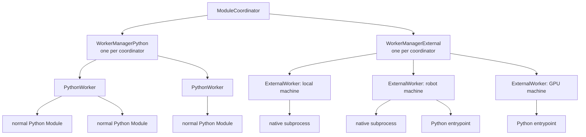
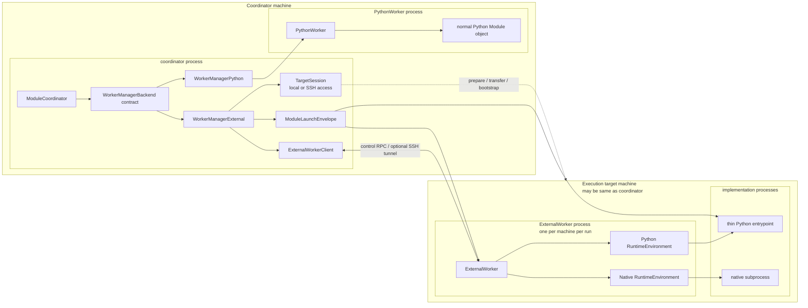
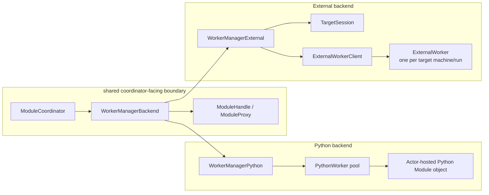

# Proposal: Module Deployment for DimOS

Status: draft for review.

This proposal defines one deployment model for normal Python modules, packaged Python modules, native modules, and remote execution. The coordinator retains a stable module contract, while deployment decides where to prepare and run its implementation.

## 1. Problem / Why now

DimOS has several deployment pressures that currently look separate:

- Python modules sometimes need heavy or conflicting dependencies that should not live in the coordinator environment.
- Native modules need repeatable build and runtime preparation.
- Remote deployment needs code or artifact sync, target preparation, process launch, logs, health, and cleanup.
- Weak robot computers may need prepared artifacts, cross-compilation, or runtime closures built elsewhere.
- Native and packaged Python modules need a shared way to describe config, stream topics, transports, and lifecycle handoff.

The common problem is **module deployment**.

The current local Python path works well for in-environment Python modules. But once a module has its own runtime requirement, DimOS needs an explicit deployment layer that can prepare the requirement, launch the implementation, and keep the Blueprint-facing module identity stable.

## 2. Current state

### Normal Python modules

Normal Python modules run inside the current DimOS Python worker environment.

```text
ModuleCoordinator
  -> WorkerManagerPython
    -> PythonWorker
      -> Python Module instance
```

They get the full DimOS surface: streams, RPCs, skills, module refs, lifecycle, and Blueprint wiring. This path should remain the default for local, in-environment Python modules.

### Current NativeModule

Today, a native module is a Python `NativeModule` wrapper deployed through the Python worker. The wrapper declares the DimOS-facing streams and config, then spawns an external executable.

```text
PythonWorker
  -> NativeModule wrapper
    -> native subprocess
```

The wrapper owns Blueprint integration, lifecycle, topic assignment, config serialization, logs, and process supervision. The native subprocess owns computation and direct pub/sub.

`NativeModuleConfig` already carries a proto launch recipe:

- `cwd`
- `executable`
- `build_command`
- `extra_args`
- `extra_env`
- `stdin_config`
- `auto_build`

When `stdin_config=True`, the wrapper sends a JSON payload to the native process:

```json
{
  "topics": {"input": "/topic#Type", "output": "/topic#Type"},
  "config": {"field": "value"}
}
```

That JSON is a useful starting point for a future **Module Launch Envelope**.

### Recent packaged Python exploration

Recent work on isolated Python runtime modules, including PR #2704, demonstrates one backend: a Python module can keep a dependency-light contract while its implementation runs in a prepared Python project.

It adds:

- runtime environment registration,
- class-keyed runtime placement,
- deployment-time runtime reconciliation,
- runtime-specific Python worker pools,
- launch through the prepared `.venv/bin/python`,
- a runnable example package.

The worker-pool design is less important than the boundary it exposes. The coordinator can import a lightweight contract without importing the implementation's dependencies.

### Native modules expose the same boundary

Recent native work serializes config and topics, adds native transports, and places Python wrappers beside buildable native packages. These changes expose the same boundary as packaged Python: a coordinator-visible contract backed by code that runs in another process. This proposal gives both paths one deployment model.

## 3. Proposed model

The proposal extends the existing manager/worker split instead of introducing a separate deployment stack. An `ExternalModule` is the lightweight contract imported by the coordinator. A `DeploymentSpec` combines a Blueprint with per-module deployment policy. A `TargetSession` provides local or SSH access during preparation. After preparation, one target-side `ExternalWorker` supervises each external implementation: native modules run as direct subprocesses, while packaged Python modules run through a thin Python entrypoint.



Section 5 defines each manager and worker in operational terms. This diagram establishes only the ownership split: normal modules remain in the Python worker pool, while external implementations run under one machine-level `ExternalWorker` per deployment run.

### 3.1 Module contract shape

`ExternalModule` is a declarative `Module` subclass. It adds an implementation reference but no build, process, watchdog, or transport behavior.

Packaged Python uses a class import reference:

```python
# Contract package: safe to import in the coordinator and control environment.
class HeavyDetector(ExternalModule):
    implementation = "heavy_detector.module:HeavyDetectorImpl"

    config: HeavyDetectorConfig
    image: In[Image]
    detections: Out[Detections]
```

```python
# python/src/heavy_detector/module.py
import heavy_dependency


class HeavyDetectorImpl(HeavyDetector):
    def start(self) -> None:
        ...
```

The thin Python entrypoint imports the class and requires:

```python
issubclass(HeavyDetectorImpl, HeavyDetector)
```

Native execution uses an executable path relative to its convention-discovered implementation folder:

```python
from pathlib import Path as FsPath


class MLSPlanner(ExternalModule):
    implementation = FsPath("target/release/mls_planner")

    config: MLSPlannerConfig
    global_map: In[PointCloud2]
    goal_pose: In[PoseStamped]
    path: Out[Path]
```

`ExternalModule.implementation` accepts `str | pathlib.Path` for ergonomic declarations. DimOS first discovers the sibling implementation folder described in section 4. A `python/` folder requires a class import reference, while `rust/` and `cpp/` require an executable path. The Python value type never selects the runtime.

The class location anchors package discovery. `ExternalModule` should not be sent to `PythonWorker`; it requires a Deployment Spec and the external worker path.

### 3.2 Complete Deployment Spec

A Deployment Spec references a Blueprint, defines reusable targets, and groups each module's deployment choices in one `ModuleDeployment`:

```python
go2_deployment = DeploymentSpec(
    blueprint=go2_stack,
    targets={
        "robot": SshTarget(
            host="go2",
            deployment_root="~/dimos-deployments/go2",
        ),
        "gpu": SshTarget(
            host="gpu-box",
            deployment_root="~/dimos-deployments/go2",
        ),
    },
    modules={
        MLSPlanner: ModuleDeployment(
            execution_target="robot",
            build_target="local",
            preparation=ArmCargoPreparation(),
        ),
        HeavyDetector: ModuleDeployment(
            execution_target="gpu",
        ),
    },
)
```

The Blueprint remains responsible for active modules, stream wiring, module references, and configuration. The `targets` map names machines, while `modules` groups each module class's deployment policy. A module omitted from `modules` executes locally. An omitted build target resolves to the execution target, and omitted preparation or runtime-environment policy comes from the discovered convention.

The implicit `local` target uses a `GlobalConfig`-derived deployment root under DimOS state and cannot be redefined. In-environment Python modules remain local because their existing object and RPC protocol depends on `PythonWorker`; remote execution requires an `ExternalModule` contract. Target probing rejects aliases that identify the same machine so the coordinator cannot start competing workers for one run.

A class-keyed `ModuleDeployment` applies to every active Blueprint instance of that class. Resolved plans and launch envelopes use unique instance IDs, which prevents two instances from colliding at the worker-control boundary. Each target's `deployment_root` contains DimOS-managed control environments, source snapshots, artifacts, runtime environments, run state, logs, caches, and locks.

### 3.3 Illustrative public model

The following shapes describe the intended extension boundary rather than a committed compatibility contract. Resolved planning and worker protocol types remain internal so their representation can change without expanding the public API.

```python
# Blueprint-facing contract whose implementation runs through the external deployment path.
class ExternalModule(Module):
    implementation: ClassVar[str | FsPath]
```

```python
# User-authored deployment intent tying one Blueprint to targets and per-module policy.
@dataclass(frozen=True)
class DeploymentSpec:
    blueprint: Blueprint
    targets: Mapping[str, ExecutionTarget]
    modules: Mapping[type[ModuleBase], ModuleDeployment]
```

```python
# Per-module policy describing where to build, where to run, and which overrides to use.
@dataclass(frozen=True)
class ModuleDeployment:
    execution_target: str = "local"
    build_target: str | None = None
    preparation: Preparation | None = None
    runtime_environment: RuntimeEnvironmentSpec | None = None
```

```python
# Serializable reference to target-side runtime-environment setup logic and config.
@dataclass(frozen=True)
class RuntimeEnvironmentSpec:
    implementation: str
    config: JsonObject = field(default_factory=dict)
```

```python
# Named remote machine where DimOS can prepare artifacts and run an ExternalWorker.
@dataclass(frozen=True)
class SshTarget(ExecutionTarget):
    host: str
    deployment_root: PurePosixPath
    expected_platform: Platform | None = None
```

`Preparation` stages source and produces deployable artifacts before `ExternalWorker` starts. `RuntimeEnvironment` turns those staged inputs into a runnable environment on the execution target:

```python
# Build/sync step that stages source or artifacts before any ExternalWorker starts.
class Preparation(ABC):
    async def prepare(self, context: PreparationContext) -> None: ...
    async def cleanup(self, context: PreparationContext) -> None: ...
```

```python
# Target-side setup step that turns prepared inputs into a launchable runtime handle.
class RuntimeEnvironment(ABC):
    async def setup(self, context: RuntimeEnvironmentContext) -> RuntimeLaunch: ...
    async def teardown(self, context: RuntimeEnvironmentContext) -> None: ...
```

Convention Presets supply both objects for standard layouts. A `ModuleDeployment` overrides either one only when a deployment needs exceptional behavior. The coordinator invokes `Preparation`, which orchestrates commands and transfers through local or SSH target sessions; the commands themselves run on the selected build and execution targets. `RuntimeEnvironment` runs on the target, so its override uses a serializable `RuntimeEnvironmentSpec`: a top-level class import reference plus JSON-compatible configuration. The plan never sends a live Python object over SSH.

Resolved plan, path, launch, environment-reference, and worker-route types remain internal.

The distinction is operational:

```text
DeploymentSpec   user-authored deployment intent
ModuleDeployment grouped policy for one module
ExternalModule   module-owned implementation declaration
DeploymentPlan   validated and fully resolved actions
```

### 3.4 Planning, prepare, and deploy

Deployment follows one ordered lifecycle:

```text
resolve modules, targets, and conventions
probe build and execution targets
prepare source and artifacts through target sessions
transfer content-addressed snapshots and outputs
bootstrap one ExternalWorker per execution machine
materialize runtime environments inside ExternalWorker
start one runtime handle per ExternalModule
wait for ready acknowledgements
```

`TargetSession` gives the coordinator access to one machine. A local session executes commands and copies files directly. An SSH session executes remote commands, transfers files, bootstraps `ExternalWorker`, and tunnels its control RPC. One `Preparation` can use both the build and execution sessions. For example, it can cross-compile on a developer workstation and then copy the executable to a robot without splitting the workflow into unrelated per-machine hooks.

Target probing records one platform identity for worker bootstrap, compilation, and artifact validation. `expected_platform`, when supplied, checks the detected result; it does not define a competing target platform.

The coordinator copies each source snapshot to a content-addressed directory beneath `deployment_root` and publishes it with an atomic rename. A snapshot contains the lightweight contract, custom deployment extensions, and implementation source. `ExternalWorker` imports a custom `RuntimeEnvironment` from that snapshot before installing module dependencies, so the extension itself must remain dependency-light.

`ExternalWorker` uses a separate, versioned control environment beneath `deployment_root/control/`. `TargetSession` transfers a pinned environment tool and provisions Python plus the control dependencies there. Remote deployment therefore does not depend on target-global Python or uv installations.

`WorkerManagerExternal` coordinates this lifecycle and rolls back completed work if another module fails. Section 5 describes its interaction with `TargetSession`, `ExternalWorkerClient`, and `ExternalWorker` without repeating those responsibilities here.

`DeploymentPlan` is immutable data consumed by the manager/worker path; it is not a separate behavioral reconciler layer.

Planning validates module declarations, target references, convention resolution, and required manifests before mutation. Preparation and runtime-environment setup validate generated artifacts before launch. A native executable may be a preparation output, so planning validates its destination rather than requiring it to exist in advance.

### 3.5 Resolved plan

The plan shows which modules require staging, where each preparation runs, and which worker path launches the implementation:

```text
Module         Build   Execute  Preparation  Environment  Worker route
Agent          local   local    —            —            WorkerManagerPython -> PythonWorker
MLSPlanner     local   robot    Cargo cross  Native       WorkerManagerExternal -> ExternalWorker -> native process
HeavyDetector  gpu     gpu      source sync  uv           WorkerManagerExternal -> ExternalWorker -> Python entrypoint
```

All deployment commands use this plan schema. Section 7 defines when the plan is previewed, persisted, and validated.

### 3.6 Module Launch Envelope

After preparation and connection resolution, the per-module runtime handle receives one unified envelope. For packaged Python, the thin entrypoint reads the envelope before importing the implementation. For native execution, `ExternalWorker` converts the envelope into argv, environment, stdin JSON, and control metadata for the subprocess.

```python
@dataclass(frozen=True)
class ModuleLaunchEnvelope:
    module_id: str
    runtime: RuntimeLaunch
    config: ModuleConfigPayload
    topics: Mapping[str, TopicBinding]
    control: ControlEndpoint
```

```json
{
  "module_id": "mls_planner-1",
  "runtime": {
    "executable": "target/release/mls_planner"
  },
  "topics": {
    "global_map": {
      "channel": "/global_map",
      "type": "sensor_msgs.PointCloud2",
      "transport": "zenoh"
    }
  },
  "config": {
    "world_frame": "map",
    "voxel_size": 0.1
  },
  "control": {
    "endpoint": "..."
  }
}
```

This extends the current `NativeModule.stdin_config` payload. DimOS may track field provenance internally, but each implementation receives one handoff containing launch metadata, module config, stream bindings, transport descriptors, and control details.

### 3.7 Process topology

The plan routes normal modules to `WorkerManagerPython` and external modules to `WorkerManagerExternal`. The two managers share the coordinator-facing deployment contract, but the worker implementations stay separate because they cross different process and machine boundaries.



Local external deployment uses the same graph with `TargetMachine` equal to `CoordinatorMachine` and a local `TargetSession`. Remote deployment inserts SSH only in the target session and optional worker-control tunnel; module stream data still uses DimOS transports.

## 4. Package discovery convention

The `ExternalModule` class file anchors package discovery. `ModuleDeployment` configures where that class builds and executes; it does not repeat implementation details. The sibling-directory convention keeps ordinary packages declarative without introducing a manifest that duplicates `pyproject.toml`, `Cargo.toml`, or `CMakeLists.txt`.

The implementation directory is selected by a hardcoded sibling convention:

```text
python/pyproject.toml   packaged Python implementation
rust/Cargo.toml        Rust executable implementation
cpp/CMakeLists.txt     C++ executable implementation
```

Python may include Pixi or Nix metadata inside `python/`:

```text
python/
  pyproject.toml
  uv.lock
  pixi.toml
  pixi.lock
  src/...
```

The `implementation` field is interpreted using the discovered directory, regardless of whether the declaration used `str` or `Path`:

```text
python/   import a Python implementation class
rust/     launch an executable relative to rust/
cpp/      launch an executable relative to cpp/
```

### Existing native precedent

Current native modules already follow a lightweight convention:

```text
mls_planner/
  mls_planner_native.py        # NativeModule wrapper and module contract
  rust/
    Cargo.toml
    Cargo.lock
    src/...
```

The wrapper declares:

```python
class MLSPlannerNativeConfig(NativeModuleConfig):
    cwd = "rust"
    executable = "target/release/mls_planner"
    build_command = "cargo build --release"
    stdin_config = True
```

Deployment should generalize this convention before adding another manifest. Existing build files already identify the implementation language and project root, so a second declaration would create two sources of truth.

The new API extends the design with a parallel declarative module, leaving the existing `NativeModule` untouched until migration:

```text
mls_planner/
  mls_planner_native.py        # existing NativeModule compatibility path
  mls_planner_external.py      # new ExternalModule declaration
  rust/
    Cargo.toml
    src/...
```

```python
from pathlib import Path as FsPath


class MLSPlanner(ExternalModule):
    implementation = FsPath("target/release/mls_planner")

    global_map: In[PointCloud2]
    path: Out[Path]
```

### Packaged Python follows the same layout

Packaged Python uses the same contract-beside-implementation structure:

```text
detector/
  detector_module.py           # ExternalModule declaration
  python/
    pyproject.toml
    uv.lock
    src/detector_runtime/
      module.py                # Runtime implementation
```

```python
class HeavyDetector(ExternalModule):
    implementation = "detector_runtime.module:HeavyDetectorImpl"

    image: In[Image]
    detections: Out[Detections]
```

V1 discovery rule:

1. Start at the `ExternalModule` class file.
2. Walk to the nearest package root.
3. Look for exactly one of `python/pyproject.toml`, `rust/Cargo.toml`, or `cpp/CMakeLists.txt`.
4. Interpret `implementation` as a Python class reference or executable path according to the matched convention.
5. Fail during planning if zero or multiple implementation directories match.

The convention can expand later, but v1 should not expose a project-root override.

### Presets turn layouts into behavior

Users should not need to repeat `uv sync`, `pixi install`, `cargo build`, or CMake commands for every module. DimOS should ship **Convention Presets** that recognize common layouts and select default `Preparation` and `RuntimeEnvironment` behavior.

Initial presets:

```text
python/pyproject.toml + python/uv.lock
  -> source Preparation + uv RuntimeEnvironment

python/pixi.toml + python/pixi.lock + python/pyproject.toml
  -> source Preparation + Pixi-backed RuntimeEnvironment

rust/Cargo.toml
  -> Cargo Preparation + native RuntimeEnvironment

cpp/CMakeLists.txt
  -> CMake Preparation + native RuntimeEnvironment
```

Preset matching uses the most specific convention within one implementation folder: a Python directory with Pixi metadata selects the Pixi-backed environment; otherwise `pyproject.toml` plus `uv.lock` selects uv. Automatic selection requires exactly one supported implementation folder. Zero or multiple matches fail unless `ModuleDeployment` supplies explicit `Preparation` and `RuntimeEnvironment` behavior that selects and validates one implementation folder within the discovered package root. Overrides do not replace package-root discovery.

## 5. Worker / runtime architecture

DimOS should unify the manager boundary, not the worker implementation. `ModuleCoordinator` should see a common backend shape for deploy, undeploy, rollback, status, and module handles. Behind that boundary, `WorkerManagerPython` remains a local Python object host and `WorkerManagerExternal` remains a target-machine deployment backend.



The shared boundary is intentionally narrow. It covers lifecycle sequencing, rollback semantics, status, logs, and the module-handle surface returned to the coordinator. It does not require the workers to share a process protocol. `PythonWorker` receives live Python classes and hosts Python objects; `ExternalWorker` receives serialized launch envelopes and supervises already-prepared target programs.

### Normal Python stays on the existing path

Normal Python modules stay local and use the existing `PythonWorker` path.

```text
Normal Python Module -> PythonWorker
```

They are not remotely deployable in v1. If a module is assigned to a non-local target, it must be packaged Python or native.

This proposal does not replace `PythonWorker`. Its object and RPC envelope already provide an efficient path for modules whose dependencies are available in the coordinator environment.

### Packaged Python always uses external deployment

Packaged Python implementations are declared through `ExternalModule` and always use `WorkerManagerExternal`, `ExternalWorker`, and a thin Python entrypoint, even on the local machine. Keeping local and remote packaged Python on the same path prevents local execution from hiding dependency, import, or lifecycle assumptions that fail after remote placement.

```text
ExternalModule -> WorkerManagerExternal -> ExternalWorker -> thin Python entrypoint
```

`ExternalWorker` spawns and supervises the entrypoint without importing user implementation code. The entrypoint runs inside the prepared Python environment, imports the implementation, verifies that it subclasses the declared `ExternalModule`, initializes it, and sends an explicit ready acknowledgement.

### Native modules reuse the external path

Native implementations use the same `ExternalModule` contract and worker hierarchy for both local and remote targets.

```text
ExternalModule -> WorkerManagerExternal -> ExternalWorker -> native subprocess
```

The existing `NativeModule` remains unchanged during initial development. New native support uses `ExternalModule`; later PRs migrate existing native modules and eventually remove `NativeModule` and `NativeModuleConfig`.

### WorkerManagerExternal

`WorkerManagerExternal` parallels `WorkerManagerPython`. It owns target definitions, module deployment policies, `TargetSession` and `ExternalWorkerClient` handles, rollback, health aggregation, and shutdown. It resolves grouped module policies, coordinates pre-worker `Preparation` through target sessions, and then requests runtime-environment setup and host launch through external-worker clients.

### TargetSession and ExternalWorker

`TargetSession` provides coordinator-side access to one target. Local sessions execute commands and transfer files directly. SSH sessions execute commands remotely, transfer content-addressed snapshots and artifacts, bootstrap `ExternalWorker`, and maintain the SSH tunnel that carries worker RPC in v1.

`ExternalWorkerClient` is the coordinator-side RPC handle. `ExternalWorker` is the target-side process for one machine and deployment run:

```text
one control connection
worker ID and machine identity
deployed module IDs
runtime handles on that machine
lease and shutdown state
```

`ExternalWorker` materializes runtime environments, starts implementation processes or handles, forwards control requests by module ID, and stops those handles during rollback or shutdown. It does not build source or transfer artifacts. Those pre-worker operations belong to `Preparation` through target sessions.

V1 uses one ExternalWorker per machine per deployment run. A future persistent target agent can implement the same worker contract later.

Within one deployment run, modules share a runtime environment only when their source digest, execution-machine identity, and resolved `RuntimeEnvironmentSpec` fingerprint match. The run ID scopes the path so another deployment cannot mutate or tear it down. `ExternalWorker` serializes setup with a target-side lock and may rerun idempotent commands instead of merging plans or maintaining a freshness database. Teardown begins only after every dependent runtime handle in that run stops. Cross-run reuse is limited to immutable source, artifact, and package-manager caches.

### Runtime handles own one implementation

The external path still needs a per-module runtime handle, but that handle is not necessarily a separate process. It owns exactly one `ExternalModule` implementation, receives one Module Launch Envelope, initializes stream and control bindings, and sends an explicit ready or failure response.

For packaged Python, the runtime handle includes the thin prepared-Python entrypoint process. That process imports and instantiates the implementation class in-process.

For native execution, the runtime handle can be only `ExternalWorker` state around a native subprocess. `ExternalWorker` converts the launch envelope into argv, environment, stdin JSON, and control metadata, forwards logs and control requests, supervises exit, and waits for the native SDK's ready acknowledgement. This extracts the process-management responsibilities currently implemented by `NativeModule` without adding another native wrapper process.

## 6. Control plane vs data plane

Deployment needs two different communication paths.

### Deployment Control Plane

The control plane carries spawn, stop, lifecycle, health, log, status, and supported method-call traffic.

For `ExternalModule` implementations, control flows through:

```text
ModuleCoordinator <-> WorkerManagerExternal <-> ExternalWorker <-> runtime handle
```

An SSH tunnel can disappear while the remote worker and its implementation processes continue running. V1 handles that failure with a bounded coordinator lease, configured through `GlobalConfig` and proposed to default to 30 seconds. `WorkerManagerExternal` may reconnect before expiry with the run's authenticated resume token. A successful resume replaces the old control session and rejects traffic from its previous connection epoch, preventing two coordinators from controlling the same worker. If the lease expires, `ExternalWorker` invalidates the token and stops its runtime handles. A persistent target agent remains later work.

### Deployment Data Plane

The data plane carries module streams such as images, point clouds, poses, paths, commands, and maps.

Those streams continue to use transports such as Zenoh, DDS, ROS, LCM, or SHM where applicable. SSH never carries module stream data, and SHM remains machine-local.

V1 should report cross-target transport assumptions in `dimos deploy plan`, but it should not attempt complete data-plane validation. Section 3.6 defines the Module Launch Envelope that carries resolved control and stream bindings into each runtime handle.

## 7. End-user UX

The safe deployment flow should be explicit:

```bash
dimos deploy plan <deployment>
dimos deploy prepare <deployment>
dimos run <deployment>
```

### `dimos deploy plan`

This command resolves the deployment without mutating local or remote targets.

It should show the resolved plan:

```text
Module           Contract        Target   Worker path
Agent            Module          local    WorkerManagerPython -> PythonWorker
MLSPlanner       ExternalModule  robot    WorkerManagerExternal -> ExternalWorker -> native process
HeavyDetector    ExternalModule  gpu      WorkerManagerExternal -> ExternalWorker -> Python entrypoint
```

The output should include build and execution targets, selected preparation and runtime-environment behavior, source and artifact paths, transport assumptions, and validation errors. A developer should be able to see both where commands will run and which runtime path will launch each implementation.

### `dimos deploy prepare`

This command mutates targets but does not launch the stack. It may create deployment roots, synchronize content-addressed source snapshots and artifacts, build native outputs, or cross-compile on one target before copying the result to another.

Prepare should be idempotent: it runs the required build or synchronization tool and relies on that tool's cache or up-to-date checks. It does not materialize module runtime environments or launch `ExternalWorker`.

After successful preparation, the command writes a content-addressed plan manifest to the local run registry and each affected target's deployment root. The manifest binds the resolved deployment declaration to its source digests, target identities, selected policies, and staged artifact paths. `dimos run <deployment>` refuses to launch when that record is absent or no longer matches the current declaration and source.

### `dimos run`

`dimos run <blueprint>` keeps today's local-default behavior.

A plain Blueprint bypasses Deployment Spec planning and uses the existing coordinator and `WorkerManagerPython` path. It cannot contain `ExternalModule` declarations because those require a Deployment Spec.

`dimos run <deployment>` verifies and loads the persisted prepared-plan manifest, bootstraps external workers, ensures module runtime environments, launches native processes or thin Python entrypoints, and registers the deployment with the same DimOS run lifecycle commands. If declarations or source no longer match the manifest, it fails before launch and asks the user to run `dimos deploy prepare` again.

Open question: should `dimos deploy <deployment>` become shorthand for prepare plus run later?

## 8. Lifecycle semantics

Deployment runs participate in the existing lifecycle model. `dimos status` shows the coordinator, managers, external workers, and runtime handles. `dimos stop` stops the complete deployment rather than only the local coordinator. `dimos restart` reruns the original command and does not prepare unless that command included preparation. `dimos log` aggregates coordinator, worker, packaged-Python, and native-process logs.

A shared runtime environment is torn down only after all dependent runtime handles stop. Immutable source snapshots and artifacts may remain cached beneath the deployment root because removing them is not part of process lifecycle cleanup.

Startup should be fail-fast:

```text
if any module fails before deployment is ready:
  stop already-started workers and runtime handles
  mark deployment failed
```

Runtime-handle death after startup should mark the deployment unhealthy. V1 should not restart it automatically because repeating a physical action may be unsafe; restart policy remains an explicit later feature.

Each `ExternalWorker` needs a coordinator lease. If the coordinator disappears, the worker stops its runtime handles instead of leaving orphaned robot processes. This lease cannot reverse arbitrary system changes, so safety-related provisioning must be bounded or self-expiring.

## 9. Implementation path / PR slicing

This should be built as a sequence of small PRs. PR #2704 should stay as a draft/reference for the packaged-runtime exploration; it should not merge as the public packaged-Python architecture because packaged Python and native implementations should share the `ExternalModule` and external worker path.

### PR 1: internal shape and skeletons

This PR establishes the internal deployment layer before changing runtime behavior. It introduces planning under `dimos/core/deployment/`, manager and worker skeletons under `dimos/core/coordination/`, the declarative `ExternalModule` base, internal deployment models, `ModuleLaunchEnvelope`, and the preparation, runtime-environment, and convention interfaces. Isolated tests should exercise the planner with fake modules and backends.

The PR does not add deployment CLI commands, alter `ModuleCoordinator`, launch packaged Python, migrate native modules, or execute remotely. Keeping those behaviors out allows review of the model without mixing it with process-management failures.

### PR 2: local packaged Python on the unified path

This PR validates the external path with local packaged Python before introducing native executables or SSH. It requires a `DeploymentSpec`, stages the Python project, connects `WorkerManagerExternal` to `ModuleCoordinator`, materializes the uv environment inside the local `ExternalWorker`, and launches a thin Python entrypoint. The imported implementation must subclass its `ExternalModule` contract. The work should preserve existing Python module semantics without extending the runtime-specific `PythonWorker` pools explored in PR #2704.

Open question: what is the first runnable entrypoint before the full deployment CLI/registry exists?

### PR 3: local native automatic prepare/build

This PR validates that the same external path can build and launch native code without changing existing `NativeModule` wrappers. It adds an `ExternalModule` declaration beside a native package such as `rust/Cargo.toml`, runs preparation through `WorkerManagerExternal` and a local `TargetSession`, validates the result through the native runtime environment, and launches the executable as a direct child of `ExternalWorker`.

Use the MLS planner package to exercise the sibling `rust/Cargo.toml` convention while keeping `MLSPlannerNative` available as the compatibility path.

### PR 4: NativeModule runtime migration

This PR begins migration only after the native path works beside the compatibility path. It moves one small example to `ExternalModule`, `ExternalWorker`, and direct native-process supervision while keeping `NativeModule` available for unmigrated packages. This avoids a repository-wide cutover before the new lifecycle has production evidence.

After the path is stable, migrate `MLSPlannerNative` and then other native modules. Remove `NativeModule` and `NativeModuleConfig` only after all callers migrate.

### PR 5: SSH remote packaged Python

This PR adds SSH only after local packaged Python validates the worker protocol. It defines SSH targets, synchronizes source into the deployment root, provisions the versioned control environment, starts one remote `ExternalWorker`, tunnels its RPC, and launches thin Python entrypoints from a target-local environment. The control contract should remain usable by a future persistent target agent.

### PR 6: SSH remote native modules

This PR adds native artifact movement after SSH control and packaged-Python staging are stable. It synchronizes content-addressed source or prepared artifacts, supports remote builds and cross-compile transfers through target sessions, materializes the native runtime environment inside the machine's existing `ExternalWorker`, and launches native subprocesses directly. Packaged-Python and native remote support remain separate because their preparation outputs and failure recovery differ.

## 10. Open questions

1. When should DimOS add optional `dimos.module.toml` or another manifest?
2. What is the PR 2 run entrypoint for local packaged-Python Deployment Specs before the full CLI/registry exists?
3. When should deployment definitions get YAML/TOML after Python-first API?
4. How should shared target profiles and local overlays layer secrets and personal machine details?
5. Should `dimos deploy <deployment>` ever become shorthand for prepare plus run?
6. When should strict data-plane compatibility checks become mandatory?
7. What is the minimal resolved-plan JSON schema for tooling and CI?
8. When should DimOS add bounded garbage collection for cached deployment roots?
