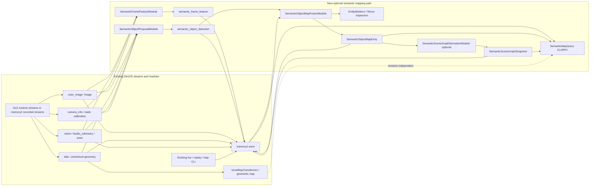

## Context

DimOS already has several pieces adjacent to semantic mapping, but no standalone stream-first semantic map that works on live robot streams and recorded streams while keeping both per-frame semantic evidence and a persistent semantic world state.

Relevant existing surfaces:

- `memory2` provides durable observations, embeddings, stream replay, lazy transforms, and vector search. `Observation` / `EmbeddedObservation`, `Stream.align`, `SqliteStore`, and the existing `SemanticSearch` module are the closest fit for per-frame semantic evidence in both live and recorded operation.
- Go2 runtime and recorded-data flows already expose stream-oriented module inputs and inspection commands. The validation recording is expected to provide the same stream shapes required at runtime: `color_image`, `lidar` or pointcloud-derived geometry, and odometry/pose streams such as `odom` or `fastlio_odometry`; reliable `depth_image` is not assumed.
- `Detection3DModule`, `Detection3DPC`, `object_scene_registration.py`, and `ObjectDB` demonstrate 2D-to-3D association and object persistence patterns, but they are not yet a general semantic map contract.
- `VoxelMapTransformer` and mapping CLI utilities provide geometric occupancy/map references, but semantic mapping must remain optional and must not become a dependency of geometric maps, costmaps, relocalization, or navigation.
- `TemporalMemory` / `EntityGraphDB` show a heavier semantic graph direction. They are useful schema inspiration, but v1 should treat any graph as a derived reasoning/index layer over a stabilized object map, not as the live mutable map.
- `EntityMarkers` and Rerun visualization are good inspection outputs, not canonical storage.

SOTA review pushes the same direction. Dense semantic SLAM systems such as Kimera-Semantics, Hydra, SemanticFusion, nvblox-style semantic ESDFs, or VLMap/OpenScene/OpenMask3D-style feature fields typically assume RGB-D, stereo/depth, pre-segmented geometry, GPU-heavy reconstruction, or a closed semantic class space. ConceptGraphs is the closest v1 design fit: it builds an object map from segmented regions, 3D support point clouds, CLIP/text features, spatial/visual association, and periodic denoise/filter/merge, then derives captions and scene-graph relations after the object map stabilizes. DimOS v1 should adapt that object-map-first update loop for live RGB + LiDAR/pointcloud + odom streams, using recorded streams only as a deterministic QA surface, and replacing ConceptGraphs' RGB-D unprojection with LiDAR-to-camera projection.

## Goals / Non-Goals

**Goals:**

- Add a stream-first, optional semantic mapping design that consumes live or recorded Go2-style camera, LiDAR/pointcloud, and pose streams.
- Persist per-frame or per-keyframe semantic features in `memory2`, including image-level embeddings, mask/crop embeddings, provenance, pose/frame context, and object-detection evidence.
- Maintain an up-to-date persistent semantic object map derived from those observations, using ConceptGraphs-style association and merge semantics.
- Use LiDAR/pointcloud geometry conservatively to anchor visual evidence into world coordinates when calibration and projection quality are sufficient.
- Support deterministic recorded-data testing and rebuilds by preserving source hashes, model/preprocessing IDs, evidence IDs, timestamp ordering, and rebuildable map updates.
- Expose inspectable outputs: semantic observations, object-map entries, derived graph/query results, and optional Rerun markers.
- Preserve existing live, recorded-data, geometric mapping, costmap, and navigation behavior when semantic mapping is absent.

**Non-Goals:**

- No dense semantic SLAM backend in v1.
- No loop closure, pose graph optimization, NeRF/Gaussian map, TSDF/ESDF semantic fusion, or semantic mesh as the canonical semantic store.
- No manipulation, autonomous motion, navigation planning, costmap integration, or MCP/skill exposure required for v1.
- No claim that open-vocabulary label scores are calibrated global probabilities.
- No irreversible entity merges or LLM-controlled ontology updates in v1.
- No scene graph as the canonical live map. Scene graph nodes/edges may be derived after object-map stabilization.
- No dependency on `depth_image`; RGB-D can be supported later as an additional geometry source.

## DimOS Architecture

### Module graph

V1 should be implemented as optional stream consumers composed into a semantic mapping blueprint or CLI flow that can run online and can also be driven by recorded streams for deterministic QA. The live update path should mirror ConceptGraphs' object-map pipeline:

```text
RGB + LiDAR + pose
  -> SAM/SAM2 masks + CLIP crop features
  -> 3D object detections from projected LiDAR support
  -> spatial + visual association
  -> object-map merge/update
  -> periodic denoise/filter/merge
  -> stable object map
  -> optional caption/relation graph derivation
```

Topology across existing and new modules:



The dashed dependency from the geometric map to query/inspection is optional context only. Existing geometric mapping, costmaps, relocalization, and navigation must not depend on the semantic path.

1. **SemanticFrameFeatureModule**
   - Inputs:
      - `color_image: In[Image]`
      - pose/odometry source aligned by timestamp, such as `odom`, `fastlio_odometry`, or pose-bearing memory2 observations
      - optional `camera_info` / static calibration metadata
   - Outputs / persistence:
      - `semantic_frame_feature` records persisted through `memory2`
   - Responsibility:
      - Select deterministic frames/keyframes.
      - Compute and store a global CLIP/image-text embedding per selected frame.
      - Store frame-level retrieval evidence; do not use the frame embedding as the object-map update unit.
      - Store model ID, preprocessing ID, embedding dimension, image/content hash, timestamp, frame ID, and pose context.
      - Apply frame selection/backpressure so live mapping can drop or defer expensive semantic work without blocking geometry or control streams.

2. **SemanticObjectProposalModule**
   - Inputs:
      - `color_image`
      - `lidar` or pointcloud geometry
      - odometry/pose
      - `camera_info` / static camera-LiDAR calibration when available
      - SAM/SAM2 masks or detector-prompted masks
   - Outputs / persistence:
      - `semantic_object_detection` records persisted through `memory2`
      - optional visualization crops/masks for live and recorded-data debugging
   - Responsibility:
      - Generate or consume SAM/SAM2 masks.
      - Compute a CLIP/OpenCLIP crop embedding per mask, optionally with text/tag features when a detector/tagger is present.
      - Project LiDAR/pointcloud into the camera image and keep support points whose projected pixels land inside the mask.
      - Produce a ConceptGraphs-shaped detection record with mask metadata, 3D support pointcloud, 3D bbox, CLIP feature, text feature, point count, pixel area, confidence, and provenance.
      - Drop low-quality proposals using mask confidence, minimum point count, maximum area ratio, and projection-quality thresholds.
      - Run mask/embedding work asynchronously or on selected frames in live operation; late semantic detections may update the object map after their source frame timestamp.

3. **SemanticObjectMapFusionModule**
   - Inputs:
      - `semantic_object_detection` records in timestamp order
      - optional existing object-map state
   - Outputs / persistence:
      - persistent `SemanticObjectMapEntry` table/store
      - optional `semantic_object_map_snapshot` stream
      - optional `EntityMarkers` visualization stream
   - Responsibility:
      - Maintain the object map as the live mutable semantic state.
      - Compute spatial similarity between new detections and existing objects using 3D bbox IoU/GIoU or point-overlap, matching ConceptGraphs' `spatial_sim_type` choices.
      - Compute visual similarity with cosine similarity over CLIP features.
      - Aggregate association scores with the ConceptGraphs-style rule: `(1 + phys_bias) * spatial_sim + (1 - phys_bias) * visual_sim`.
      - Merge detections into the best object when the score passes threshold; otherwise create a candidate object.
      - Merge by appending/downsampling/denoising support pointclouds, recomputing bbox, incrementing `num_detections`, preserving evidence refs, and weighted-averaging normalized CLIP/text features.
      - Periodically denoise, filter, and merge duplicate objects. Only promote objects for query/graph output after minimum point and minimum detection thresholds.
      - Keep object-map updates idempotent by evidence ID so live and recorded executions can converge despite batching or delayed model inference.

4. **SemanticSceneGraphDerivationModule**
   - Inputs:
      - stable object-map entries
   - Outputs / persistence:
      - optional `SemanticSceneGraphSnapshot`
      - optional graph relation records
   - Responsibility:
      - Build graph nodes from stable object-map entries, not from one-frame masks.
      - Derive captions/labels and spatial relations after object-map stabilization or on demand.
      - Treat graph edges as rebuildable summaries. They must never be the source of truth for object-map updates.

5. **SemanticMapQuery surface**
   - V1 may be CLI-only or module RPC; MCP/skills are not required.
   - Minimum query behavior should support:
      - text query over per-frame embeddings
      - text query over stable object-map entries
      - list/show persistent object entries
      - list/show derived graph relations when graph derivation is enabled
      - inspect evidence provenance for an object or graph node

### Pose, frame, and TF alignment

Misaligned semantic overlays are a product failure. V1 should make spatial provenance explicit instead of treating pose as an incidental field.

Existing DimOS anchors to reuse:

- Live modules access `self.tf`, backed by `LCMTF` / `MultiTBuffer`, for timestamped transform lookup with `time_point`, `time_tolerance`, and optional `forward_tolerance`.
- `Transform` already supports composition, inverse lookup, matrix conversion, and pose conversion.
- `memory2` persists `Observation.ts`, optional `pose_tuple`, and `tags`; frame IDs are not first-class metadata there, so semantic records must store frame IDs in their payload and/or tags.
- `memory2.Stream.at(t, tolerance)` and `.align(other, tolerance)` provide deterministic recorded-data temporal joins.
- `Detection3DPC.from_2d()` is the projection precedent: a 2D detection plus camera intrinsics plus a timestamped transform between pointcloud frame and camera optical frame produces a world-frame support pointcloud.

The semantic mapping path should use a two-anchor model:

```text
Evidence anchor
  source observation IDs
  source timestamps
  source frame IDs
  TF lookup frame pair + lookup timestamp + tolerance
  model/preprocess IDs

Resolved spatial anchor
  resolved world/map frame ID
  world pose / centroid / bbox
  support pointcloud in resolved frame
  projection quality and confidence
```

The evidence anchor is the audit/rebuild contract. The resolved spatial anchor is the query/visualization contract. Both must be persisted for any semantic object evidence that can affect the object map.

Recommended alignment flow for a selected RGB frame:

```text
image_obs.ts
  -> align nearest pointcloud/odometry observations within configured tolerance
  -> lookup TF at image_obs.ts:
       tf.get(camera_optical_frame, pointcloud.frame_id, image_obs.ts, tolerance)
       tf.get(world_frame, robot/base frame, image_obs.ts, tolerance) when available
  -> project pointcloud into image mask using camera intrinsics
  -> store SemanticObjectDetection with source IDs + TF provenance + resolved support geometry
  -> merge into SemanticObjectMapEntry only from resolved geometry with acceptable quality
```

Rules:

- Use the source image timestamp as the primary timestamp for mask/crop embeddings and projection, because the mask pixels correspond to that image.
- Use pointcloud/odometry observations only when they align within a configured tolerance; otherwise skip or mark geometry-dependent evidence low-confidence.
- Query TF at the source image timestamp. For live streams, allow a small `forward_tolerance` only when waiting for a near-future TF is preferable to dropping the frame; never block geometry/control streams while waiting.
- Persist the frame pair used for projection, for example `camera_optical_frame` and `pointcloud_frame_id`, plus the lookup timestamp and tolerance. Do not rely on implicit global frame names.
- Store all object-map geometry in one resolved spatial frame per map version, such as `world` or `map`, and record that frame on every object-map entry and snapshot.
- Treat `EntityMarkers`/Rerun output as a projection of persisted object-map entries. It must not recompute or silently reinterpret poses.
- If pose correction or loop closure later changes the global frame, rebuild object-map geometry from evidence anchors rather than mutating graph relations or marker positions in place.
- Never create stable object-map entries from image-only detections unless their spatial fields are explicitly absent/low-confidence; they may remain retrieval evidence or candidates, but should not produce authoritative 3D markers.

Recorded-data QA should compare two execution modes over the same bounded window:

1. live-like stream order with normal backpressure settings,
2. deterministic recorded-data rebuild with ordered `.align(..., tolerance=...)` joins.

The resulting stable object-map entries should agree within the configured spatial tolerance, or report projection/TF quality failures explicitly. This is the guardrail against semantic markers that look plausible in isolation but float, lag, or rotate incorrectly in the map.

### Data contracts

The v1 semantic feature is an evidence record and object-map entry, not a dense voxel label. Recommended records:

```python
SemanticFrameFeature:
    observation_id: str
    timestamp_ns: int
    frame_id: str
    resolved_pose_frame_id: str | None
    image_ref: str
    image_hash: str
    pose_world_robot: PoseWithCovariance | None
    pose_source: str | None
    pose_observation_id: str | None
    pose_lookup_tolerance_s: float | None
    model_id: str
    preprocess_id: str
    embedding_dim: int
    global_embedding_ref: str
    keyframe: bool
```

```python
SemanticObjectDetection:
    evidence_id: str
    source_image_observation_id: str
    source_pointcloud_observation_id: str | None
    source_pose_observation_id: str | None
    timestamp_ns: int
    image_frame_id: str
    camera_optical_frame_id: str
    pointcloud_frame_id: str | None
    resolved_frame_id: str | None
    tf_lookup_parent_frame_id: str | None
    tf_lookup_child_frame_id: str | None
    tf_lookup_timestamp_ns: int | None
    tf_lookup_tolerance_s: float | None
    box2d: Box2D | None
    mask_ref: str | None
    label_text: str | None
    detector_score: float | None
    crop_embedding_ref: str | None
    text_embedding_ref: str | None
    support_pointcloud_ref: str | None
    support_pointcloud_frame_id: str | None
    bbox_world: Box3D | None
    world_centroid: Vec3 | None
    world_covariance: Matrix3 | None
    associated_point_count: int
    pixel_area: int
    mask_confidence: float
    projection_quality: float
    association_quality: float
    candidate_object_id: str | None
```

```python
SemanticObjectMapEntry:
    object_id: str
    map_version: str
    resolved_frame_id: str
    canonical_label: str | None
    aliases: list[str]
    label_scores: dict[str, float]
    clip_embedding_ref: str | None
    text_embedding_ref: str | None
    support_pointcloud_ref: str | None
    position_world: Vec3 | None
    covariance: Matrix3 | None
    bbox_world: Box3D | None
    point_count: int
    num_detections: int
    evidence_ids: list[str]
    first_seen_ns: int
    last_seen_ns: int
    confidence: float
    status: Literal["candidate", "stable", "merged", "pruned", "stale"]
```

```python
SemanticSceneGraphSnapshot:
    snapshot_id: str
    source_object_map_version: str
    node_object_ids: list[str]
    relations: list[SemanticRelation]
    generated_at_ns: int
    graph_model_id: str | None
```

```python
SemanticRelation:
    source_object_id: str
    relation: str
    target_object_id: str
    confidence: float
    evidence_ids: list[str]
```

The update rule for a matched detection should follow ConceptGraphs' merge semantics:

```python
merged_pointcloud = denoise_or_downsample(object.pointcloud + detection.pointcloud)
merged_bbox = recompute_bbox(merged_pointcloud)
merged_clip = normalize(
    (object.clip_embedding * object.num_detections + detection.clip_embedding)
    / (object.num_detections + 1)
)
merged_num_detections = object.num_detections + 1
```

These can begin as Python dataclasses or Pydantic-style models stored through `memory2`/SQLite, then be promoted to message types only if stream transport needs require it. If a new module-to-module RPC contract is needed, define a DimOS `Spec` Protocol such as `SemanticMapSpec` with methods like `query(text: str)`, `get_object(object_id: str)`, `get_graph(snapshot_id: str)`, and `snapshot()`; do not confuse this with OpenSpec behavior specs.

### Runtime behavior

- The semantic mapper must be **live-compatible**: it consumes timestamped streams, updates incrementally, and never requires the full sequence up front.
- Recorded-data execution is the deterministic test harness, not the architecture. The same modules should run against live streams, simulation streams, or memory2 recorded streams.
- Expensive perception should be bounded by configuration: keyframe rate, minimum motion/novelty between processed frames, maximum masks per frame, maximum object proposals per frame, and model concurrency.
- Semantic updates may lag sensor frames. The object map should apply updates by original observation timestamp/evidence ID rather than by wall-clock completion order.
- Backpressure policy should prefer dropping/deferring semantic frames over blocking geometric mapping, robot control, or safety-critical streams.
- Real-time outputs should expose current best-effort object-map state. Offline/recorded rebuilds may recompute with denser frame selection or heavier models, but they should use the same persisted evidence and merge semantics.

### Blueprint and CLI

- If a new semantic mapping blueprint is introduced, compose it from the existing Go2 runtime/mapping stack plus `SemanticFrameFeatureModule`, `SemanticObjectProposalModule`, and `SemanticObjectMapFusionModule` as optional modules. A recorded-data QA variant may use the same modules against memory2 recorded streams. `SemanticSceneGraphDerivationModule` should remain optional and derived.
- If the blueprint is added as a runnable public blueprint, regenerate `dimos/robot/all_blueprints.py` via `pytest dimos/robot/test_all_blueprints_generation.py`.
- CLI/docs should document both live stream prerequisites and recorded-data inspection commands. Recorded-data QA should verify the same stream contract expected by live operation.
- Semantic outputs should be inspectable during live operation and from recorded-data runs without requiring robot actuation.

### Transports and storage

- Prefer memory2/SQLite persistence for semantic evidence, object-map state, and derived graph snapshots.
- Use stream outputs for live inspection and Rerun visualization, not as the only durable store.
- Large image blobs and embeddings should be stored by reference/hash where memory2 already supports this pattern.

## Decisions

1. **Use ConceptGraphs-style object-map-first updates for v1.**
   - Decision: store CLIP/global image embeddings per frame/keyframe in memory2, store SAM/SAM2 mask crop embeddings as object detections, lift masks to 3D support pointclouds via LiDAR projection, and update a persistent object map before deriving any graph.
   - Rationale: this gives a concrete update loop: detection list -> spatial similarity -> visual similarity -> thresholded association -> object merge -> periodic denoise/filter/merge. It is more actionable and less flaky than making a scene graph or one-frame entity extraction the primary map.
   - Alternatives: dense voxel semantic probabilities, full scene graph, CLIP-only retrieval. Dense semantic voxels are expensive and not needed for v1; full scene graphs are too heavy as live state; CLIP-only retrieval does not maintain a world/object map.

2. **Treat LiDAR as conservative geometry anchoring, not semantic source of truth.**
   - Decision: use LiDAR/pointcloud to build the 3D support pointcloud and bbox for each SAM/SAM2 mask when projection/calibration quality is sufficient.
   - Rationale: ConceptGraphs uses depth to unproject masks into object pointclouds. The available Go2 recorded-data baseline has LiDAR and odom, not reliable RGB-D, so DimOS should replace depth unprojection with projected LiDAR support. Projection errors should reduce confidence rather than create hard world facts.
   - Alternatives: require depth image, use all projected points as semantic labels, or ignore geometry. Requiring depth blocks the target data; labeling all points creates false precision; ignoring geometry fails the persistent map requirement.

3. **Persist both evidence anchors and resolved spatial anchors.**
   - Decision: every frame feature, object detection, object-map entry, and derived graph node/edge retains evidence IDs pointing back to memory2 observations/features, source frame IDs, source timestamps, and TF lookup metadata when geometry projection was used. Object-map entries also store resolved world/map-frame geometry for query and visualization.
   - Rationale: odom drift, detector errors, TF timing gaps, calibration errors, and embedding ambiguity are expected. Rebuildability and auditability are more important than a compact irreversible world state, while query/inspection still needs resolved geometry that does not require replaying projection on every lookup.

4. **Keep scene graphs derived, not canonical.**
   - Decision: graph nodes should reference stable object-map entries, and graph edges should be rebuilt after object-map stabilization or on demand.
   - Rationale: ConceptGraphs first accumulates and cleans an object map, then extracts captions and relations. Using the graph as live state would make one-frame mask splits/merges into graph mutations and would be harder to audit.

5. **Keep semantic mapping optional and separate from geometric mapping.**
   - Decision: semantic modules may consume geometric streams and outputs, but existing `global_map`, `global_costmap`, navigation, live operation, and recorded-data flows must not depend on semantic outputs.
   - Rationale: proposal compatibility requires no regressions to geometric mapping, live operation, or recorded-data inspection.

6. **Use `EntityMarkers`/Rerun as a derived inspection layer.**
   - Decision: publish semantic object/graph visualization only after persistent object-map updates.
   - Rationale: visualization is useful for QA, but it should not define canonical semantics.

7. **Scope v1 queries to retrieval and inspection.**
   - Decision: support text-to-frame/object/place retrieval, current object-map inspection, and optional derived graph inspection. Do not promise action planning, object permanence guarantees, or dense semantic reconstruction.

## Safety / Simulation / Recorded-data QA

- Primary QA surface is deterministic execution over an existing robot-dog room recording. This validates the same stream contracts used in live operation.
- Required streams must be validated before running semantic mapping: `color_image`, LiDAR/pointcloud geometry, and odometry/pose. `camera_info`/calibration should be used when available; if not available, object proposals remain image/pose-only, are marked low-confidence, or are skipped.
- The module must run without robot actuation. No skills, MCP tools, movement commands, manipulation, or navigation behavior are introduced in v1.
- Existing live run commands, `dimos --replay run ...`, and mapping inspection commands must continue to work when semantic modules are not included.
- Manual QA should:
  1. list streams for the target recording,
  2. run the semantic mapping blueprint/CLI over a bounded recorded-data window,
  3. confirm memory2 contains semantic frame features,
  4. confirm semantic object detections are generated from masks/crops and projected LiDAR support,
  5. confirm persistent object-map entries update over time via matched merges and new candidates,
  6. inspect Rerun or CLI output for plausible semantic object markers and optional derived graph relations,
  7. run existing live/recorded geometric map flow without semantic modules to confirm independence.

## Risks / Trade-offs

- **2D-to-3D association can create false object candidates.** Mitigate with mask-confidence thresholds, minimum point counts, maximum mask area ratio, projection-quality scoring, repeated detections, and candidate/stable/pruned statuses.
- **TF or pose misalignment can make plausible semantic markers look wrong in the map.** Mitigate by using image timestamp as the projection timestamp, bounded stream alignment tolerances, explicit TF lookup metadata, projection-quality scoring, and recorded-data QA that compares live-like stream execution with deterministic rebuilds.
- **Object-map association can fragment or overmerge objects.** Mitigate with ConceptGraphs-style combined spatial and visual scoring, conservative thresholds, periodic duplicate merging, and evidence-backed rebuilds. Do not make merges irreversible without retained evidence.
- **Odom drift corrupts world coordinates.** Store pose source/covariance and evidence provenance; make object maps rebuildable when better poses are available.
- **Open-vocabulary labels are not calibrated probabilities.** Store label scores as belief weights tied to evidence, not as globally normalized class probabilities.
- **Embedding averaging can lose meaning.** Keep raw evidence refs and use embedding centroids only for indexing or approximate retrieval.
- **Scene graphs can hide map uncertainty.** Treat graph nodes/edges as derived summaries from stable object-map entries. Keep the object map and evidence refs inspectable.
- **Dense semantic map expectations may exceed v1.** Document that v1 is a semantic evidence and object map, not semantic SLAM.
- **GPU/model dependencies can reduce recorded-data repeatability.** Pin model/preprocessing IDs and prefer cached embeddings; recomputation should be explicit.
- **Calibration gaps may limit geometry anchoring.** Degrade gracefully to pose-anchored frame evidence and skip or mark object detections low-confidence rather than failing existing live or recorded-data flows.

## Migration / Rollout

- Add the semantic mapping modules and storage types behind optional blueprint/CLI surfaces.
- Do not modify existing geometric mapping contracts except to document semantic mapping as an optional consumer.
- Add docs for stream prerequisites, live and recorded-data command examples, output inspection, and the distinction between semantic object maps, derived graphs, and geometric/costmap outputs.
- If adding a public blueprint, regenerate `dimos/robot/all_blueprints.py` with `pytest dimos/robot/test_all_blueprints_generation.py`.
- Rollout can start with a recorded-data QA path, while keeping the module contracts live-compatible from the start; live/sim blueprint variants can be enabled once stream timing and backpressure behavior are stable.
- Rollback is removing the optional semantic modules/blueprint from composition; persisted semantic stores are additive and should not affect existing recordings or maps.

## Open Questions

- Which embedding model should be the default for v1: reuse the existing CLIP provider exactly, or introduce a newer open-vocabulary image/text embedding backend behind an adapter Protocol?
- Should v1 use SAM/SAM2 automatic masks only, or detector/tagger-prompted SAM masks like ConceptGraphs-Detect for better object candidates?
- What is the canonical calibration source for projecting Go2 LiDAR points into camera frames across live, simulation, and recorded-data execution?
- Should persistent object-map entries live in a new memory2-backed store, reuse part of `EntityGraphDB`, or start as a smaller dedicated SQLite schema?
- What query surface should be public first: CLI-only, module RPC through a DimOS `Spec` Protocol, or both?
- Which ConceptGraphs thresholds should become DimOS defaults: `mask_conf_threshold`, `min_points_threshold`, `sim_threshold`, `phys_bias`, `merge_interval`, and duplicate-merge visual/text similarity thresholds?
